# Polyframes Visuals

Processing experiments and sketches for live shows.
To be exported with `saveFrame()` and the Processing Movie Maker for editing in a video editor.

## Sketches and status

### Work In Progress

#### colors

Experiment with blending colors. For RGB split effect.

### Planned

#### noise

Lo-fi video noise effect.

#### paisley

Something with the Paisley pattern.

### Finished

#### backgrounds

_We All Differ_ basis backgrounds.
 

#### bars

vertical bars with noisy width.
 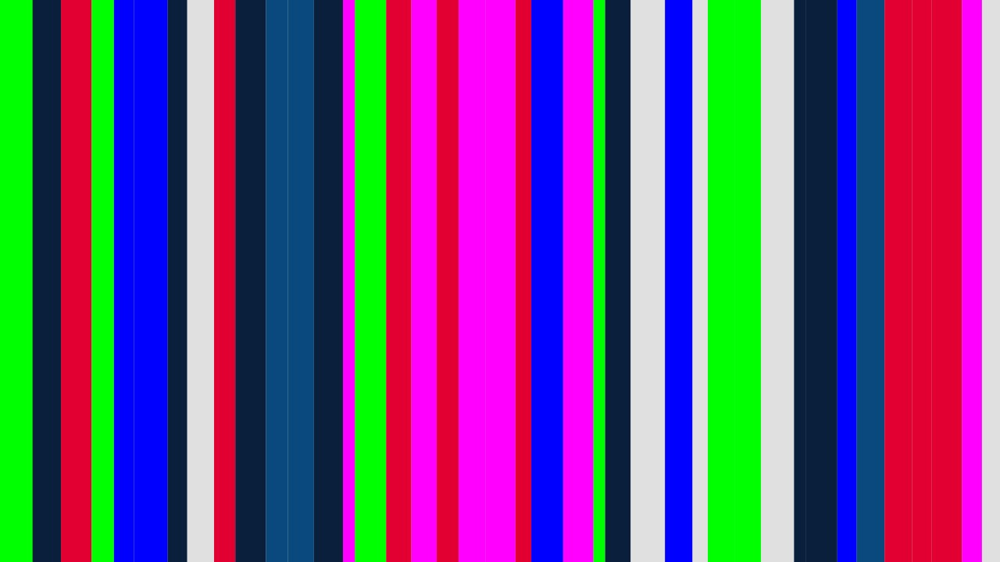

#### breathing_circle

slowly growing/shrinking, breathing circle
 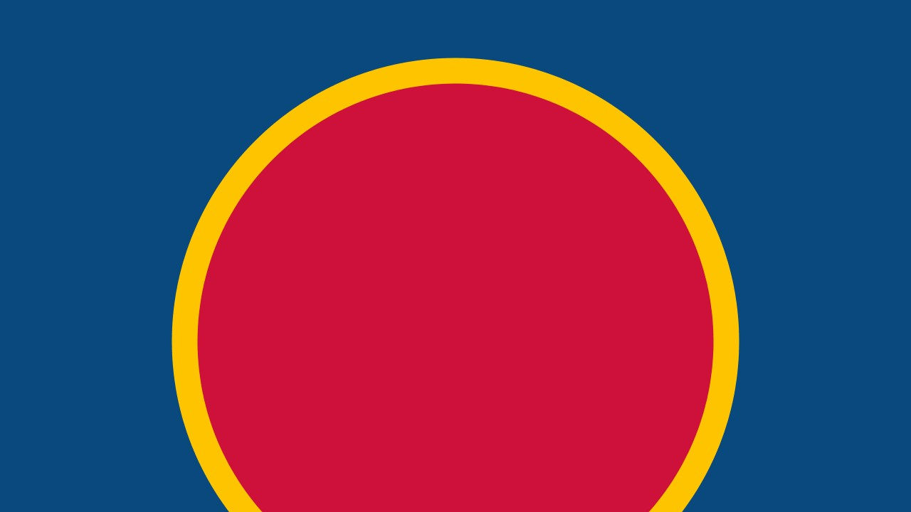

#### circles

Circles zooming out. Small to large.
 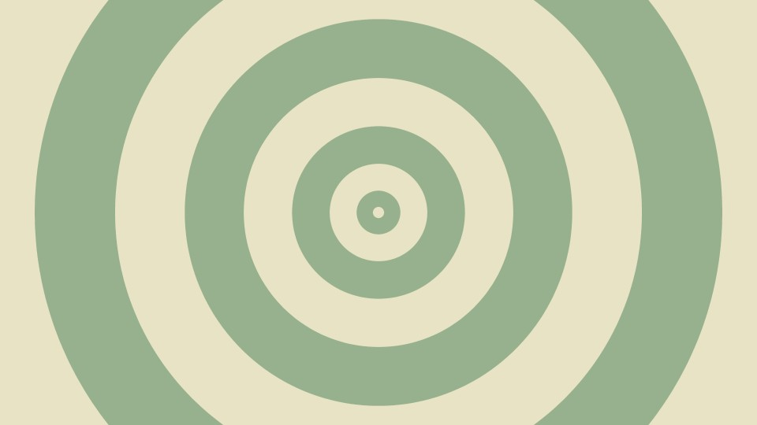

#### desert_dream

flight over dunes
 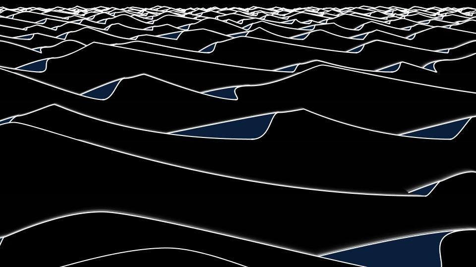

#### eyes

_We All Differ_ eyes circling around and slowly zooming in
 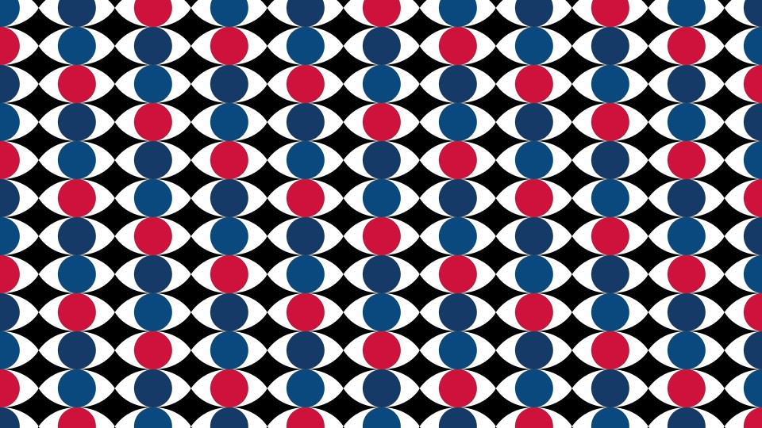

#### falling_stars

Falling (snow?) nightly stars
 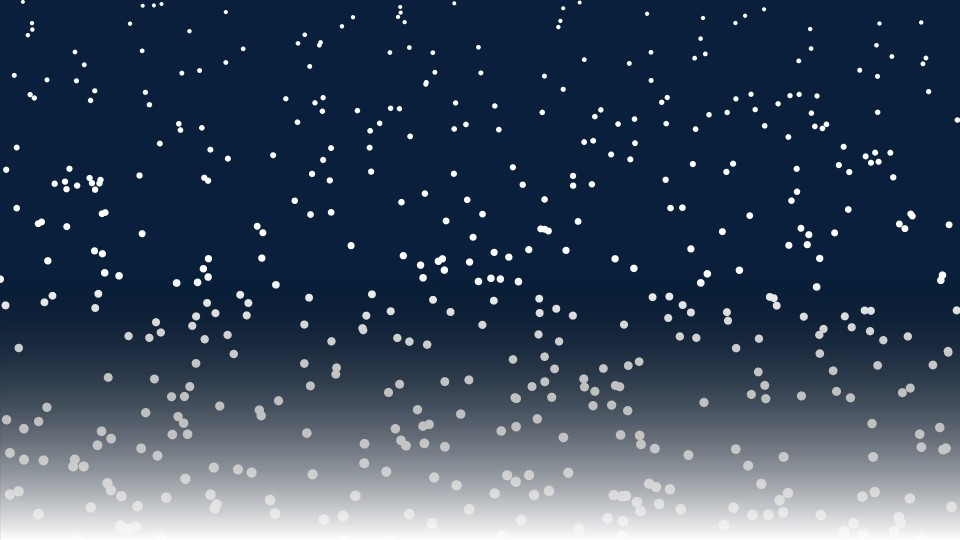

#### flashes

Rhythmic flashes for drumfill
 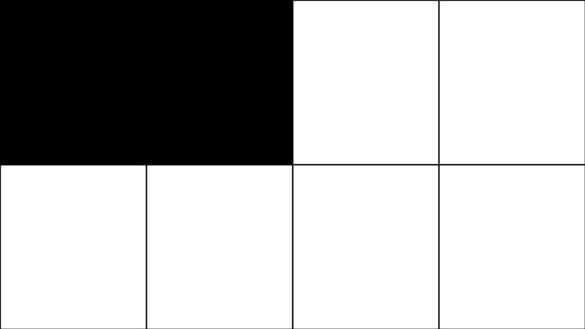

#### hexes

Mirrored, shrinking hexagons with a sprinkle of glitch.
 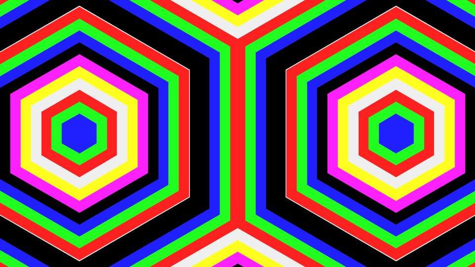

#### lamp1

Mars Volta lamp effect, outside view
 

#### lamp2

Mars Volta lamp effect, (correct) inside view
 

#### planets

Passing circles, like planets.
 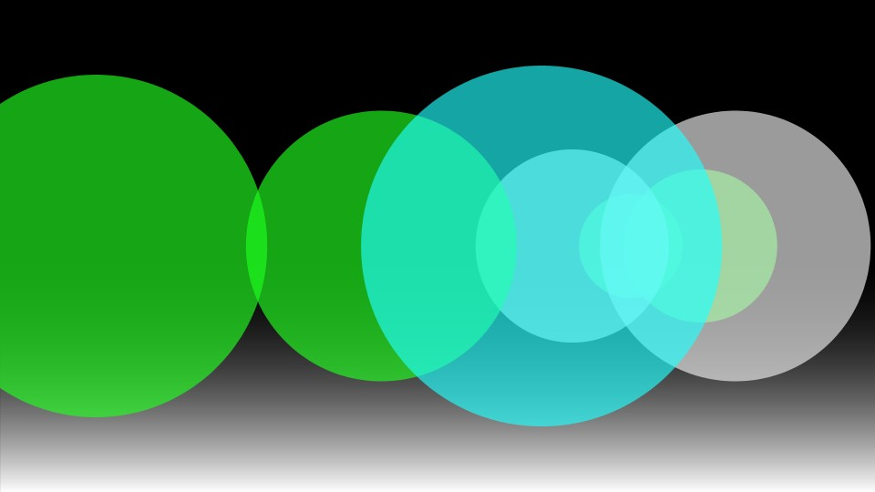

#### popping_circles

Spots (dis)appearing.
 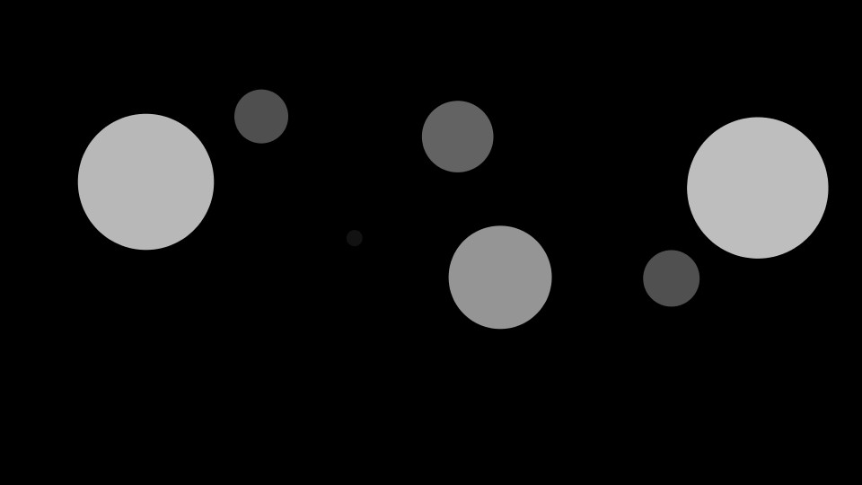

#### rainbow

Drugged out happy rainbow
 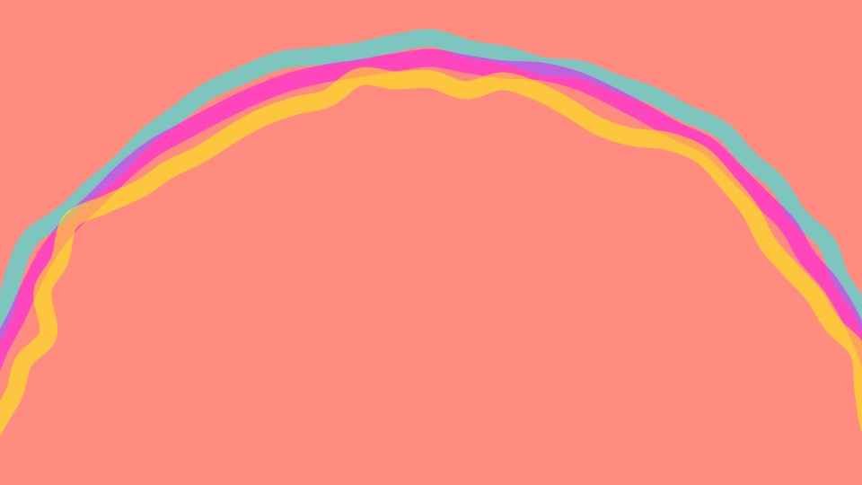

#### rects

Rectangles zooming in. Large to small.
 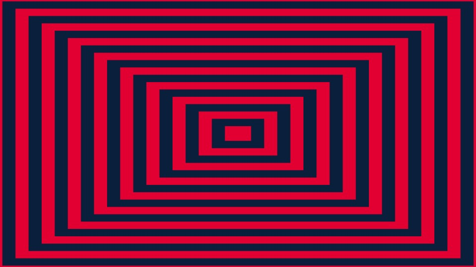
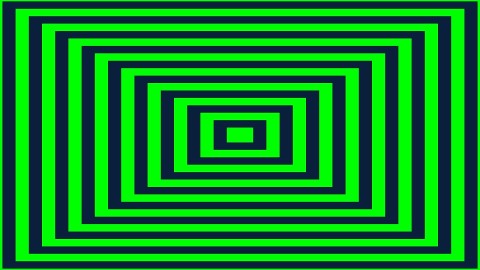

#### richter

Black and white moving rectangles. Very quick approximation of Hans Richter's art.
 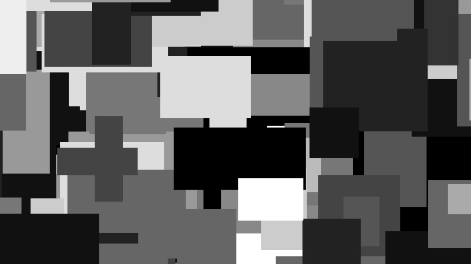

#### scanner

Imitating scanner lighting. 5 different patterns.
 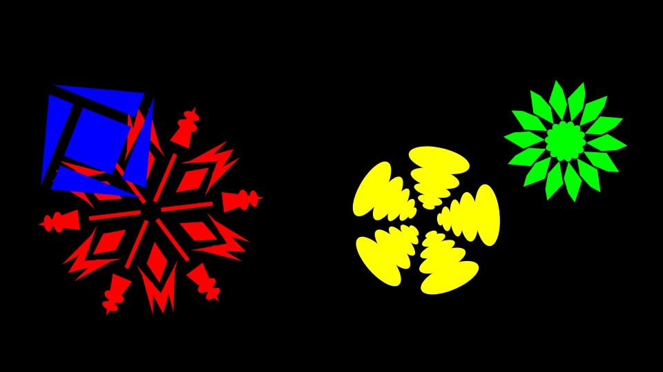

#### skyline

Randomly growing/shrinking vertical bars. (Like a skyline?)
 

#### whirlwind

Spirals turning with alternate colors
 
